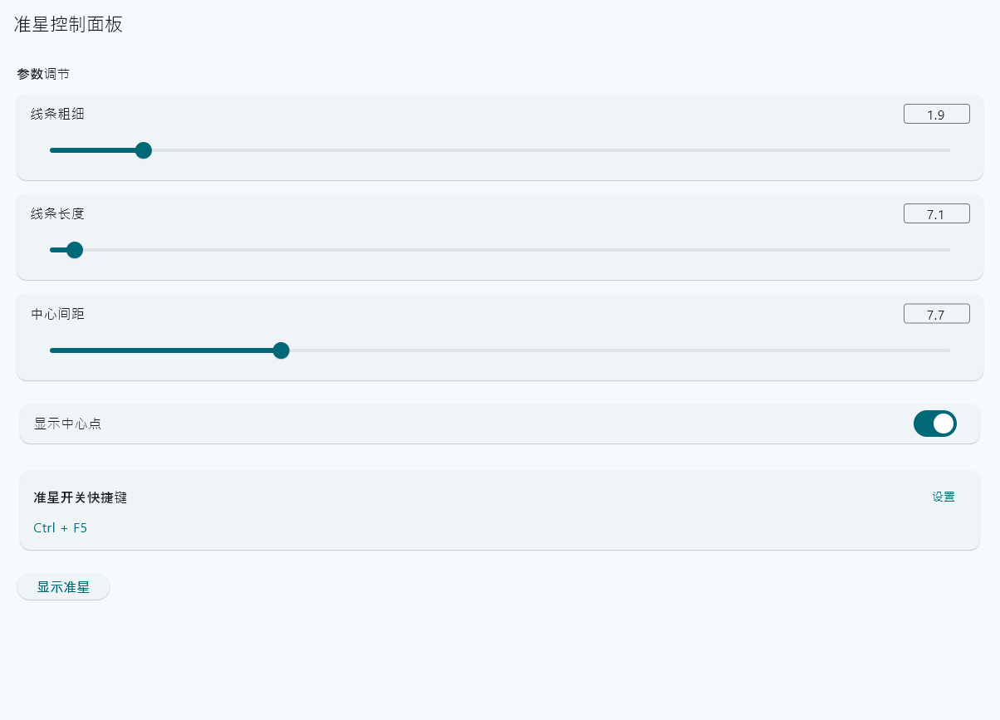
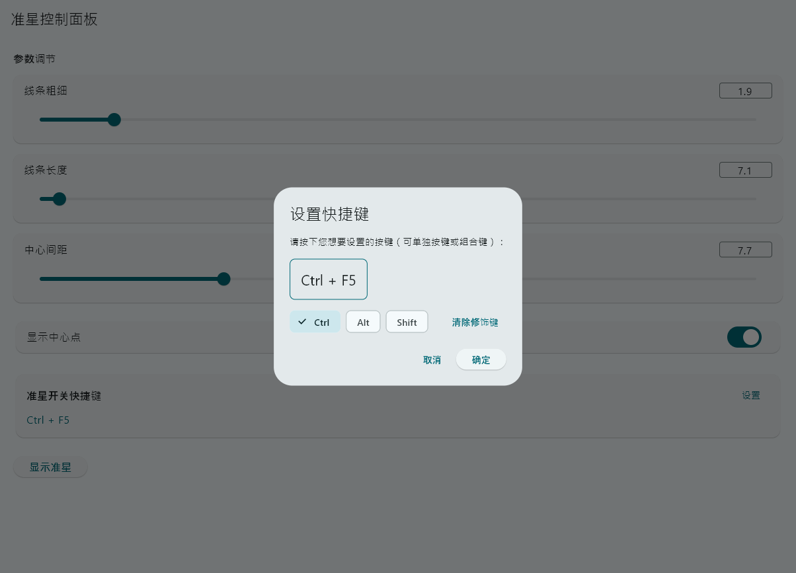
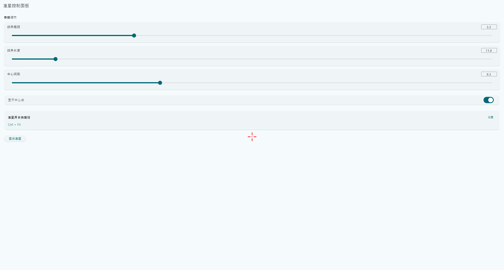

# Foresight - Windows 游戏辅助准星工具

一个基于 Flutter 开发的 Windows 平台游戏辅助准星工具，提供透明、无边框、始终置顶的准星窗口，支持自定义参数和快捷键控制。

## 效果展示

### 控制面板界面



### 快捷键设置



### 准星效果



## 功能特性

### 🎯 准星显示
- **透明窗口**：完全透明的准星窗口，不影响游戏画面
- **无边框设计**：简洁的准星线条，无窗口边框干扰
- **始终置顶**：准星窗口始终显示在所有窗口最上层
- **屏幕中心**：准星自动居中显示在屏幕中央
- **点击穿透**：准星窗口不拦截鼠标点击，可正常操作游戏

### ⚙️ 参数调节
- **线条粗细**：可调节准星线条的粗细（1-10）
- **线条长度**：可调节准星线条的长度（5-80）
- **中心间距**：可调节准星中心空白区域的大小（0-30）
- **中心点显示**：可选择是否显示中心圆点
- **手动输入**：支持通过文本输入框精确输入参数值
- **滑块拖拽**：支持通过滑块快速调节参数

### ⌨️ 快捷键支持
- **自定义快捷键**：支持设置任意按键组合（如 F1、Ctrl+H、Alt+F1 等）
- **单独按键**：支持设置单独的功能键或字母键
- **组合键**：支持 Ctrl、Alt、Shift 等修饰键组合
- **全局热键**：快捷键在系统全局生效，即使应用不在前台也能触发

### 💾 数据持久化
- **自动保存**：所有参数设置自动保存到本地
- **自动恢复**：应用重启后自动恢复上次的设置
- **Hive 存储**：使用高性能的 Hive 数据库进行本地存储

## 技术栈

- **Flutter**：跨平台 UI 框架
- **Dart**：编程语言
- **FFI (Foreign Function Interface)**：与 C++ 原生代码交互
- **Hive**：轻量级本地数据库
- **Win32 API**：Windows 原生窗口和热键功能

## 系统要求

- Windows 10/11
- Flutter SDK 3.9.2 或更高版本

## 安装与运行

### 环境准备

1. 安装 [Flutter SDK](https://flutter.dev/docs/get-started/install/windows)
2. 确保已安装 Visual Studio 2019 或更高版本（包含 C++ 桌面开发工具）

### 运行项目

```bash
# 克隆项目
git clone <repository-url>
cd foresight

# 安装依赖
flutter pub get

# 运行应用
flutter run -d windows
```

### 构建发布版本

```bash
# 构建 Windows 应用
flutter build windows --release
```

构建完成后，可执行文件位于 `build\windows\x64\runner\Release\foresight.exe`

## 使用说明

### 基本操作

1. **启动应用**：运行应用后，会显示控制面板窗口
2. **调节参数**：
   - 使用滑块拖拽快速调节
   - 或在右侧输入框中手动输入精确数值
3. **显示准星**：点击"显示准星"按钮或使用快捷键
4. **隐藏准星**：再次点击按钮或使用快捷键

### 快捷键设置

1. 在控制面板中找到"准星开关快捷键"区域
2. 点击"设置"按钮
3. 在弹出的对话框中：
   - 按下想要设置的按键（支持单独按键或组合键）
   - 使用 FilterChip 选择修饰键（Ctrl/Alt/Shift）
   - 点击"清除修饰键"可设置单独按键
4. 点击"确定"保存设置

### 参数说明

- **线条粗细**：控制准星线条的宽度，数值越大线条越粗
- **线条长度**：控制准星线条从中心向外的延伸长度
- **中心间距**：控制准星中心空白区域的大小，数值越大空白越大
- **显示中心点**：开启后会在准星中心显示一个圆形点

## 项目结构

```
foresight/
├── lib/
│   ├── main.dart              # 应用入口
│   ├── menu.dart              # 控制面板界面
│   ├── crosshair_window.dart  # 准星窗口 FFI 封装
│   └── keyboard_hook.dart     # 键盘钩子 FFI 封装
├── windows/
│   └── runner/
│       ├── main.cpp           # Windows 主程序入口
│       ├── crosshair_window.cpp  # 准星窗口 C++ 实现
│       ├── crosshair_window.h    # 准星窗口头文件
│       ├── keyboard_hook.cpp     # 键盘钩子 C++ 实现
│       └── keyboard_hook.h       # 键盘钩子头文件
└── pubspec.yaml               # 项目配置文件
```

## 开发说明

### 核心实现

- **准星窗口**：使用 Win32 API 创建透明、无边框、置顶的窗口，通过 GDI 绘制准星
- **全局热键**：使用 Windows RegisterHotKey API 注册全局热键
- **参数同步**：通过 FFI 在 Dart 和 C++ 之间传递参数，确保快捷键和按钮操作使用相同的参数

### 注意事项

- 准星窗口使用 `WS_EX_TRANSPARENT` 实现点击穿透
- 使用 `LWA_COLORKEY` 实现透明效果
- 全局热键需要在主消息循环中处理 `WM_HOTKEY` 消息
